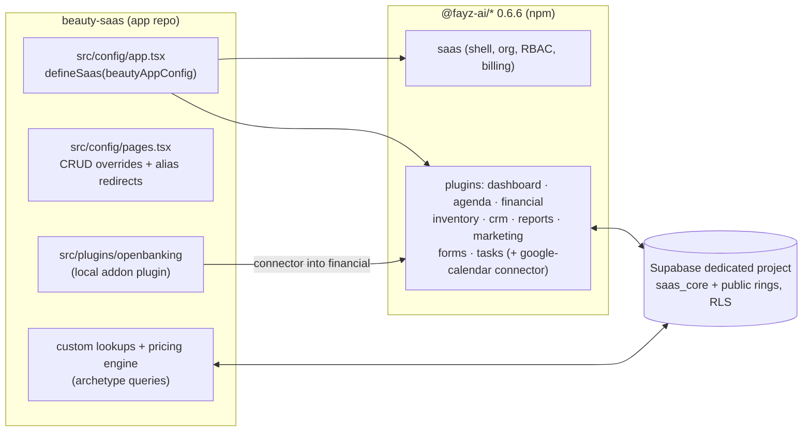

# ARCHITECTURE — how beauty-saas is built (as-is)

Status: canonical · Updated: 2026-07-06
Source of truth: `src/config/app.tsx` (670 lines — the richest `defineSaas` config in the fleet) + `drizzle/` migrations. SDK contracts: `fayz-sdk/docs/` (ARCHITECTURE, PLUGINS, DATA-MODEL, CUSTOMIZATION). Companions kept from the earlier era: [data-model.md](data-model.md) and [foundation-critique.md](foundation-critique.md) (still-accurate deep analyses).

beauty-saas is the reference consumer of the fayz-sdk: a standalone Vite app that composes published `@fayz-ai/*` packages (0.6.6 line) via `defineSaas(config)` → `renderApp`. Everything app-specific lives in config, registry overrides, and one local plugin — zero SDK forks.

---

## 1. Composition

- Layout `topbar`, locale pt-BR (+en via `tl()` helper), currency BRL, Supabase auth adapter (requireAuth, split login, Google OAuth) with mock fallback, multi-org Supabase adapter.
- **Clinic persona preset**: `VITE_BEAUTY_PRESET=clinic` returns only [dashboard, agenda(no locationSelection), financial(no reconciliation)] — implemented, kept as persona-engine evidence, not deployed (DECISIONS 2026-07-02).

## 2. Plugins and their configuration (the interesting parts)

| Plugin | Config highlights |
|---|---|
| dashboard (app-composed) | 12 KPI metrics over `v_bookings`/`v_clients`/`v_staff` (`src/lib/dashboard-data.ts`, direct count/list + client-side aggregation); 3 KPIs still hardcoded (rating, occupancy, product-sales) |
| **agenda** | kinds mapped to archetypes (booking=appointment, order=service_order, professional=staff, client=customer); 6 statuses with day-scoped transitions; custom `contactLookup`/`serviceLookup` (real `saas_core` queries + `resolveServicePricing` price-table/variation engine); `financialBridge` auto-creates service orders; `onBookingCreated` → waitlist conversion; 3 settings registries (cancellation reasons, confirmation channels, schedule rules); businessHours 08–20, slot 30min, buffers/advance rules |
| **financial** | provider = `withAccountingDimensionReconciliation(createSafeFinancialProvider())` — a Proxy that boosts reconciliation match scores by accounting dimensions (±0.08); `modules.reconciliation: true`; `onBookingClick` → agenda deep-link via `agenda:open-booking` CustomEvent (the event-bus seam gap, documented SDK-side) |
| **openbanking** (local, `src/plugins/openbanking`) | `scope:'addon'`, `dependencies:['financial']`; Tecnospeed PlugBank connector into Financial → Integrations; edge fn `supabase/functions/plugbank-sync`; the incubator-plugin reference for the whole SDK |
| google-calendar (from plugin-agenda) | connector UI present; **`google-calendar-sync` edge fn not in this repo** — sync inoperative until deployed |
| inventory | products+stock only (`recipes:false, batchTracking:false`) |
| crm | `clientConversion` → writes `saas_core.persons` + `public.clients` (lead→client) |
| reports (app-composed) | 11 reports over `rep_*` views; `occupancy-rate` `available:false` |
| marketing | `domain:'beauty'`; **static demo data — no persistence** (the façade module) |
| forms | settings-hub placement ("Formulários e Documentos"); template kinds include anamnesis |
| tasks | drawer defaults |

**App-owned custom surface** (ladder levels 5–6): `/clients` canonical CRUD + care-profile entity (lifecycle/stage/anamnesis fields); client-detail tabs (Perfil de Atendimento, Pedidos canonical via `createClientOrdersProvider`, Linha do Tempo, Documentos, Extrato); alias redirects preserving old routes (`/appointments`→`/orders`, `/quotes`→`/orders`, `/activity`→`/timeline`, `/journey|/evidence`→`/documentos`); agenda vertical pages (Confirmations/Cancellations/Waitlist/ExecutionChecklist — all Supabase-wired); `/registry` group (9 CRUD entities); service `_properties` pages (packages, package items, price tables/items/variations, default products/templates).

## 3. Data

- **Dedicated Supabase project** (per the SDK topology standard — a real business's SaaS gets its own project). Tenant "Glow Studio" + clinic tenant exist.
- **Two-ring schema in practice**: `saas_core` (persons/products/services/orders/bookings/schedules/categories/locations + tenancy/RBAC) + `public` extensions (clients, staff_members, appointments + app tables: appointment_* config tables, waitlist entries, service_packages/price_tables/variations, bank_integrations) + `v_*`/`rep_*` views.
- **Migrations: Drizzle is the live source** (`drizzle/0000–0017`, `drizzle.config.ts`); the 40 hand-written SQL files were retired to `supabase/migrations.legacy/`. Seeds: `supabase/seed-saas-core.sql`, `seed-beauty-agenda.sql`; apply scripts in `scripts/`.
- **RLS**: canonical predicate everywhere; the Ring-2 gap (app tables created after auto-discovery ran) was closed 2026-07-02 by `drizzle/0016` + `0017` (explicit enable+policies on 14 named tables).
- Data-layer reality check: every enabled SDK plugin runs its **real Supabase provider** (`createSafe*` = supabase-or-mock, resolving to Supabase here). The exception is marketing (no provider — static arrays).

## 4. Auth, RBAC, tenancy

Supabase auth + Google OAuth; native team invites (v0.2.0). App-owned RBAC (`src/config/permissions.ts`): 34 features grouped by module × read/create/edit/delete; 6 default profiles (owner, administrador, secretaria, profissional, marketing, financeiro); plugins gate nav/actions on `{feature, action}`; **deny-by-default** in multi-tenant (v1 is default-allow — a deliberate posture flip).

## 5. Deploy & operations

The fayz pipeline only (DECISIONS 2026-07-02): push → fayz project installs `@fayz-ai/*` from npm → `vite build` → Publicar → `beauty-saas.live.fayz.ai`. Dev on `localhost:5180` (see [testing.md](testing.md) for accounts). Local dev may resolve the SDK from `../../fayz-sdk` source; the build path never does.

## 6. Honest gaps in this architecture (tracked)

- Marketing façade (no provider) — biggest looks-built-isn't item.
- Google-calendar sync edge fn missing from the repo.
- 3 hardcoded dashboard KPIs (no ratings source; no slot-capacity view — same blocker as the occupancy report).
- Cross-plugin nav via window CustomEvents (`agenda:open-booking`) — pending the SDK event bus.
- Direct `saas_core` queries in app lookups (sanctioned but flagged: seams the SDK should eventually provide).
- Feature-level completeness vs v1: [GAP-ANALYSIS.md](GAP-ANALYSIS.md).
