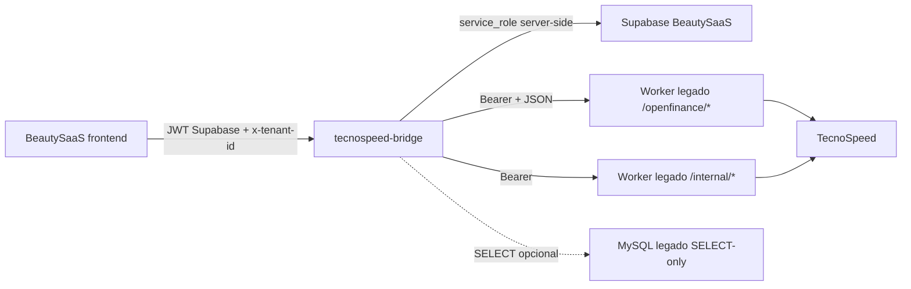

# Integração BeautySaaS + TecnoSpeed Open Finance via bridge

Documento técnico para revisão do responsável pelo projeto BeautySaaS/Fayz.

## Objetivo

Integrar o plugin financeiro do BeautySaaS ao worker TecnoSpeed legado sem criar
um segundo consumidor direto da TecnoSpeed.

O navegador fala apenas com o bridge do BeautySaaS. O bridge roda no servidor
Windows e fala com:

1. Supabase do BeautySaaS, para persistência oficial do novo sistema.
2. API interna do worker legado, para jobs e leituras internas.
3. API Open Finance pública do worker legado, para criar/atualizar/sincronizar
   contas usando JSON e `Authorization: Bearer`.
4. MySQL legado, opcionalmente, usando usuário somente `SELECT`, para reaproveitar
   extratos já persistidos sem acionar a TecnoSpeed.

O bridge não deve chamar TecnoSpeed diretamente quando estiver em modo legado.

## Arquitetura final



## Regras de segurança

- `LEGACY_OPENFINANCE_API_TOKEN`, `LEGACY_WORKER_TOKEN` e
  `SUPABASE_SERVICE_ROLE_KEY` ficam somente no `.env` do bridge.
- Nenhuma credencial server-side é `VITE_*`.
- O frontend não conhece URL/token do worker legado.
- Chamada backend-to-backend não usa `apiKey` na query string.
- O bridge valida JWT Supabase e `x-tenant-id`.
- Em produção, `BRIDGE_AUTH_MODE=development` é proibido.
- Em modo `STATEMENT_SOURCE=legacy_worker`, `TECNOSPEED_DIRECT_SYNC=false` é
  obrigatório.

## Variáveis de ambiente relevantes

No bridge:

```env
NODE_ENV=production
BRIDGE_HOST=127.0.0.1
BRIDGE_PORT=3001
BRIDGE_ALLOWED_ORIGINS=http://localhost:5180
BRIDGE_STORAGE=supabase
BRIDGE_AUTH_MODE=supabase
BRIDGE_EMBED_WORKER=false

STATEMENT_SOURCE=legacy_worker
TECNOSPEED_DIRECT_SYNC=false
TECNOSPEED_MOCK=true

LEGACY_WORKER_URL=http://127.0.0.1:3030
LEGACY_WORKER_TOKEN=...
LEGACY_WORKER_TIMEOUT_MS=10000

LEGACY_OPENFINANCE_API_URL=http://127.0.0.1:3020
LEGACY_OPENFINANCE_API_TOKEN=...
LEGACY_OPENFINANCE_API_TIMEOUT_MS=30000

LEGACY_READ_SOURCE=mysql
LEGACY_MYSQL_HOST=127.0.0.1
LEGACY_MYSQL_PORT=3306
LEGACY_MYSQL_DATABASE=...
LEGACY_MYSQL_USER=beauty_bridge_reader
LEGACY_MYSQL_PASSWORD=...
LEGACY_MYSQL_CONNECTION_LIMIT=3

SUPABASE_URL=https://...
SUPABASE_ANON_KEY=...
SUPABASE_SERVICE_ROLE_KEY=...
```

No BeautySaaS frontend:

```env
VITE_TECNOSPEED_BRIDGE_URL=http://127.0.0.1:3001
VITE_SUPABASE_URL=https://...
VITE_SUPABASE_ANON_KEY=...
```

## Contratos chamados pelo bridge

### API Open Finance pública do worker

Usada pelo bridge para ações. Sempre com:

```text
Authorization: Bearer <LEGACY_OPENFINANCE_API_TOKEN>
Content-Type: application/json
```

Endpoints:

```text
POST   /openfinance/create-account
POST   /openfinance/sync
PUT    /openfinance/account/:accountHash
DELETE /openfinance/account/:accountHash
PUT    /openfinance/account/:accountHash/openfinance/revoke
GET    /openfinance/account-status
GET    /openfinance/transactions
GET    /openfinance/sync-status
GET    /openfinance/sync-metrics
```

Exemplo `POST /openfinance/create-account`:

```json
{
  "name": "Cliente Teste",
  "cpfCnpj": "00000000000",
  "neighborhood": "Centro",
  "addressNumber": "123",
  "zipcode": "00000000",
  "state": "RJ",
  "city": "Rio de Janeiro",
  "bankCode": "341",
  "agency": "0001",
  "accountNumber": "123456",
  "accountNumberDigit": "7",
  "accountDac": "7"
}
```

Se o worker retornar `409 payer_name_mismatch`, o bridge preserva o status/código
e o frontend pede confirmação. Somente após confirmação o frontend reenvia com:

```json
{ "confirmPayerUpdate": true }
```

Exemplo `POST /openfinance/sync`:

```json
{
  "accountHash": "abc123",
  "dateStart": "2025-06-01",
  "dateEnd": "2026-06-01",
  "statementType": "BANK",
  "priority": "manual",
  "suspendAutoSyncUntilCompleted": true
}
```

### API interna do worker

Mantida para leituras/job tracking interno:

```text
GET  /internal/health
GET  /internal/payers/:cpfCnpj
GET  /internal/accounts?payerCpfCnpj=...
GET  /internal/statements?payerCpfCnpj=...&accountHash=...&statementType=BANK&from=...&to=...&page=1&pageLimit=50
POST /internal/sync-jobs
GET  /internal/sync-jobs/:jobId
```

## Fluxo de conta

1. Usuário informa CPF/CNPJ no conector financeiro.
2. Front chama o bridge para salvar/testar integração.
3. Usuário abre formulário de conta.
4. Front envia ao bridge dados do pagador/endereço/conta.
5. Bridge tenta encontrar conta existente no reader legado, quando disponível.
6. Se encontrar, salva vínculo no Supabase e não chama criação no worker.
7. Se não encontrar, bridge chama `POST /openfinance/create-account` no worker.
8. Worker cria ou reutiliza pagador/conta e retorna `accountHash`,
   `openfinanceLink` e `statusOpenfinance`.
9. Bridge normaliza e salva a conta no Supabase.
10. Front mostra link de autorização Open Finance quando existir.

## Fluxo de sincronização/extrato

1. Usuário seleciona conta e período.
2. Front exibe aviso de janela Open Finance e pede confirmação explícita do
   período antes de qualquer sincronização.
3. Front chama `POST /api/v1/tecnospeed/statements/preview` no bridge.
4. Bridge consulta transações já salvas via reader legado.
5. Se `coverage.complete=true`, grava/atualiza transações no Supabase e retorna
   linhas imediatamente.
6. Se cobertura estiver incompleta, bridge chama `POST /openfinance/sync` com
   `priority="manual"` e `suspendAutoSyncUntilCompleted=true`.
7. Se o worker retornar `already_synced`, o bridge consulta transações
   imediatamente.
8. Se retornar `queued` ou `running`, o front acompanha via
   `/api/v1/tecnospeed/sync-jobs/:jobId`.
9. Se retornar `retry_wait`, o front mostra mensagem e respeita
   `nextAllowedAt`/`nextSyncAllowedAt`.
10. Quando concluir, o bridge importa as transações normalizadas para o Supabase.

## Janela Open Finance e ampliação de período

Existe um risco operacional relevante: se o usuário solicita um período curto
agora e depois decide ampliar para um ano, a conta pode estar dentro da janela
de espera do banco/TecnoSpeed/worker. Por isso o frontend deve sempre deixar
claro que o período escolhido deve ser o período completo desejado.

O ajuste feito no frontend:

- nunca sincroniza sem `from` e `to`;
- mostra aviso fixo antes do botão de sincronização;
- pede confirmação para qualquer busca;
- reforça a confirmação para períodos acima de 90 dias;
- mostra `retry_wait` com data/hora quando o worker retorna
  `nextAllowedAt` ou `nextSyncAllowedAt`.

### Contrato recomendado para o worker

O bridge não consegue sozinho tirar uma conta da rotina do cron legado. Se o
worker atualiza a mesma conta automaticamente, ele pode consumir a janela de 6h
antes da busca manual longa ser executada.

Para produção, o bridge envia uma fila/prioridade de sincronização manual com
pausa temporária da rotina automática da conta:

```text
POST /openfinance/sync
{
  "accountHash": "abc123",
  "dateStart": "2025-06-01",
  "dateEnd": "2026-06-01",
  "statementType": "BANK",
  "priority": "manual",
  "suspendAutoSyncUntilCompleted": true
}
```

Comportamento esperado:

1. Worker recebe pedido manual longo.
2. Worker marca a conta como `manual_sync_pending`.
3. Cron automático ignora temporariamente essa conta.
4. Worker aguarda `nextAllowedAt`, se necessário.
5. Quando a janela abre, executa a busca manual solicitada.
6. Após sucesso/falha terminal, worker reativa a rotina automática.

Sem esse suporte no worker, o bridge consegue apenas:

- exibir avisos;
- respeitar `retry_wait`;
- evitar jobs duplicados no BeautySaaS;
- pedir novamente o período ao worker quando o usuário solicitar.

## Deduplicação e escopo

- Transações usam `externalId` estável vindo do worker/MySQL.
- O reader MySQL prioriza `transactionId`, depois `fitid`, depois fingerprint.
- Persistência do BeautySaaS fica escopada por:
  - `tenant_id`;
  - `integration_id`;
  - `account_hash`;
  - `external_source`;
  - `external_id`;
  - `statement_type`.
- Datas são normalizadas para `YYYY-MM-DD` antes de gravar no Supabase.
- O bridge não deve transformar datas em texto local, como `Thu Jun 18`.

## Arquivos principais alterados

Bridge:

- `local-services/tecnospeed-bridge/src/clients/legacy-openfinance-api.js`
- `local-services/tecnospeed-bridge/src/config.js`
- `local-services/tecnospeed-bridge/src/runtime.js`
- `local-services/tecnospeed-bridge/src/services/legacy-openfinance.js`
- `local-services/tecnospeed-bridge/.env.example`
- `local-services/tecnospeed-bridge/README.md`
- testes em `local-services/tecnospeed-bridge/test/`

Frontend Open Banking:

- `src/plugins/openbanking/connectorDef.tsx`
- `src/plugins/openbanking/data/supabase.ts`
- `src/plugins/openbanking/types.ts`

## Testes executados

```powershell
cd C:\Users\pedro\beauty-saas\beauty-saas\local-services\tecnospeed-bridge
npm.cmd test
```

Resultado local: 26 testes passando.

```powershell
cd C:\Users\pedro\beauty-saas\beauty-saas
npx.cmd tsc -p tsconfig.local.json
$env:FAYZ_SDK_SOURCE='local'; npx.cmd vite build
```

Resultado local: TypeScript e build Vite passando. O Vite emite apenas avisos de
chunk grande/import dinâmico já existentes no SDK.

## Pendências para produção/IIS/Supabase

- Definir se o bridge ficará acessível por IIS/HTTPS ou somente local no Windows.
- Se BeautySaaS rodar fora do servidor Windows, expor o bridge por rota privada.
- Configurar `LEGACY_OPENFINANCE_API_URL` com `http://127.0.0.1:3020` quando bridge
  e worker estiverem na mesma máquina; usar URL privada/IIS quando não estiverem.
- Aplicar migrations do bridge no Supabase antes de rodar com `BRIDGE_STORAGE=supabase`.
- Criar usuário MySQL somente `SELECT`, caso `LEGACY_READ_SOURCE=mysql`.
- Validar contrato real do worker para formatos exatos de resposta em:
  - `create-account`;
  - `sync`;
  - `sync-status`;
  - `account-status`.

## Orientação para IA/revisor que continuar

1. Não mova token do worker para o frontend.
2. Não reative `TECNOSPEED_DIRECT_SYNC` no bridge em modo legado.
3. Não substitua o worker por chamadas diretas TecnoSpeed.
4. Se alterar contrato do worker, ajuste primeiro
   `local-services/tecnospeed-bridge/src/clients/legacy-openfinance-api.js`.
5. Se alterar persistência/dedup, revise
   `local-services/tecnospeed-bridge/src/repositories/supabase.js` e as migrations.
6. Se alterar UX de cadastro, mantenha o tratamento explícito de
   `payer_name_mismatch`.
7. Rode sempre:

```powershell
cd C:\Users\pedro\beauty-saas\beauty-saas\local-services\tecnospeed-bridge
npm.cmd test
cd C:\Users\pedro\beauty-saas\beauty-saas
npx.cmd tsc -p tsconfig.local.json
```

Depois valide build Vite com acesso ao SDK local.
