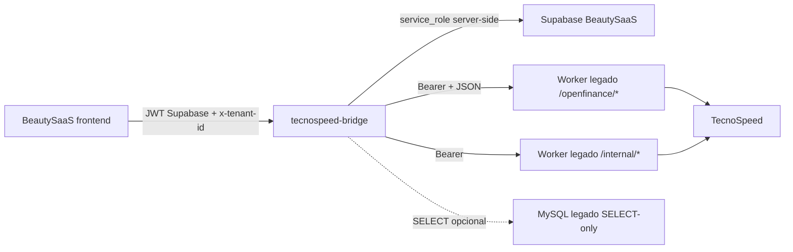

# Integração BeautySaaS + TecnoSpeed Open Finance via bridge

Documento técnico para revisão do responsável pelo projeto BeautySaaS/Fayz e
para continuidade por outra IA/agente.

## Resumo executivo

O BeautySaaS passa a integrar Open Finance/TecnoSpeed sem chamar a TecnoSpeed
diretamente e sem expor credenciais sensíveis no navegador.

O fluxo implementado é:

```text
BeautySaaS frontend
  -> tecnospeed-bridge
  -> worker TecnoSpeed legado
  -> MySQL/fila/TecnoSpeed existentes
  -> Supabase BeautySaaS
  -> plugin-financial
```

O worker legado continua sendo a única peça autorizada a falar com a TecnoSpeed.
O bridge existe para adaptar autenticação, tenant, UX do BeautySaaS, leitura de
dados existentes e persistência no Supabase.

## Objetivos

- Conectar o BeautySaaS ao worker TecnoSpeed já existente.
- Manter o Supabase como banco oficial do novo sistema.
- Evitar chamadas diretas do frontend para o worker.
- Evitar chamadas diretas do bridge para a TecnoSpeed em modo legado.
- Reaproveitar transações já salvas pelo worker.
- Importar transações normalizadas para o financeiro do BeautySaaS.
- Preservar tenant/RLS e deduplicação.
- Dar ao usuário uma UX clara para cadastro de pagador/conta e busca por período.

## Fora de escopo nesta etapa

- Substituir o worker legado.
- Criar novo cron TecnoSpeed.
- Revogar/desativar contas diretamente na TecnoSpeed pelo BeautySaaS.
- Usar Supabase Edge Function para sincronizar com TecnoSpeed.
- Expor token do worker, service role ou credenciais TecnoSpeed no navegador.

## Arquitetura



## Responsabilidades por componente

### Frontend BeautySaaS

- Lê `VITE_TECNOSPEED_BRIDGE_URL`.
- Obtém JWT Supabase e tenant ativo.
- Chama somente o bridge.
- Exibe formulário de CPF/CNPJ, pagador, endereço e conta.
- Exibe link de autorização Open Finance.
- Exige período explícito antes de sincronizar.
- Mostra estados de fila e mensagens de erro sanitizadas.
- Importa somente linhas selecionadas pelo usuário.

### Bridge

- Valida JWT Supabase e tenant.
- Guarda tokens server-side.
- Fala com o worker usando `Authorization: Bearer`.
- Lê transações existentes via API interna ou MySQL read-only.
- Solicita jobs manuais ao worker.
- Normaliza datas e valores.
- Deduplica transações.
- Salva dados no Supabase.

### Worker legado

- Continua responsável por TecnoSpeed.
- Cria/atualiza pagador e conta.
- Gera link de autorização Open Finance.
- Executa sincronizações respeitando fila, retry e travas da TecnoSpeed/banco.
- Mantém MySQL e rotina existente.

## Regras de segurança

- O navegador nunca recebe:
  - `LEGACY_OPENFINANCE_API_TOKEN`;
  - `LEGACY_WORKER_TOKEN`;
  - `SUPABASE_SERVICE_ROLE_KEY`;
  - `TECNOSPEED_CNPJSH`;
  - `TECNOSPEED_TOKENSH`.
- O frontend não chama o worker diretamente.
- O bridge não usa `apiKey` em query string para chamadas backend-to-backend.
- Em modo legado:

```env
STATEMENT_SOURCE=legacy_worker
TECNOSPEED_DIRECT_SYNC=false
TECNOSPEED_MOCK=false
```

- `BRIDGE_AUTH_MODE=development` não deve ser usado em produção.
- O usuário MySQL do bridge, se usado, deve ser exclusivo e somente `SELECT`.

## Configuração de ambiente

### BeautySaaS frontend

Local direto no bridge:

```env
VITE_TECNOSPEED_BRIDGE_URL=http://127.0.0.1:3001
VITE_SUPABASE_URL=https://...
VITE_SUPABASE_ANON_KEY=...
```

Bridge publicado por IIS/reverse proxy:

```env
VITE_TECNOSPEED_BRIDGE_URL=http://20.206.206.215/beauty-bridge
VITE_SUPABASE_URL=https://...
VITE_SUPABASE_ANON_KEY=...
```

Após alterar `.env.local`, reiniciar o Vite.

### Bridge

Exemplo de `.env` para modo legado real:

```env
NODE_ENV=production
BRIDGE_HOST=127.0.0.1
BRIDGE_PORT=3001
BRIDGE_ALLOWED_ORIGINS=http://localhost:5180
BRIDGE_WORKER_ID=beauty-bridge-1
BRIDGE_WORKER_POLL_MS=5000
BRIDGE_EMBED_WORKER=false

BRIDGE_STORAGE=supabase
BRIDGE_AUTH_MODE=supabase

STATEMENT_SOURCE=legacy_worker
TECNOSPEED_DIRECT_SYNC=false
TECNOSPEED_MOCK=false

LEGACY_WORKER_URL=http://127.0.0.1:3030
LEGACY_WORKER_TOKEN=...
LEGACY_WORKER_TIMEOUT_MS=10000

LEGACY_OPENFINANCE_API_URL=http://127.0.0.1:3020
LEGACY_OPENFINANCE_API_TOKEN=...
LEGACY_OPENFINANCE_API_TIMEOUT_MS=30000

LEGACY_READ_SOURCE=mysql
LEGACY_MYSQL_HOST=127.0.0.1
LEGACY_MYSQL_PORT=3306
LEGACY_MYSQL_DATABASE=plugbank
LEGACY_MYSQL_USER=beauty_bridge_reader
LEGACY_MYSQL_PASSWORD=...
LEGACY_MYSQL_CONNECTION_LIMIT=3
LEGACY_MYSQL_SSL=false

SUPABASE_URL=https://...
SUPABASE_ANON_KEY=...
SUPABASE_SERVICE_ROLE_KEY=...

TECNOSPEED_WEBHOOK_TOKEN=...
```

### Observação sobre mock

`TECNOSPEED_MOCK=true` só serve para smoke test isolado. Para testar com worker
real, conta real ou homologação/produção:

```env
TECNOSPEED_MOCK=false
```

As credenciais TecnoSpeed devem continuar somente no worker legado.

## Contratos com o worker

### Autenticação

Chamadas bridge -> worker devem usar:

```http
Authorization: Bearer <LEGACY_OPENFINANCE_API_TOKEN>
Content-Type: application/json
```

Não usar `apiKey` na URL.

### API Open Finance pública do worker

Endpoints de ação:

```text
POST   /openfinance/create-account
POST   /openfinance/sync
PUT    /openfinance/account/:accountHash
DELETE /openfinance/account/:accountHash
PUT    /openfinance/account/:accountHash/openfinance/revoke
```

Endpoints de leitura:

```text
GET /openfinance/account-status
GET /openfinance/transactions
GET /openfinance/sync-status
GET /openfinance/sync-metrics
```

Exemplo de criação/vinculação de conta:

```json
{
  "name": "Cliente Teste",
  "cpfCnpj": "00000000000",
  "email": "cliente@example.com",
  "neighborhood": "Centro",
  "addressNumber": "123",
  "zipcode": "00000000",
  "state": "RJ",
  "city": "Rio de Janeiro",
  "address": "Rua Teste",
  "bankCode": "341",
  "agency": "0001",
  "accountNumber": "123456",
  "accountNumberDigit": "7",
  "accountDac": "7"
}
```

Se o worker retornar `409 payer_name_mismatch`, o frontend exibe confirmação e
só reenvia com:

```json
{
  "confirmPayerUpdate": true
}
```

Exemplo de sync manual:

```json
{
  "accountHash": "abc123",
  "dateStart": "2025-06-01",
  "dateEnd": "2026-06-01",
  "statementType": "BANK",
  "priority": "manual",
  "suspendAutoSyncUntilCompleted": true
}
```

### API interna do worker

Mantida para health, lookup e job tracking:

```text
GET  /internal/health
GET  /internal/payers/:cpfCnpj
GET  /internal/accounts?payerCpfCnpj=...
GET  /internal/statements?payerCpfCnpj=...&accountHash=...&statementType=BANK&from=...&to=...&page=1&pageLimit=50
POST /internal/sync-jobs
GET  /internal/sync-jobs/:jobId
```

## Fluxo de cadastro/vinculação de conta

1. Usuário informa CPF/CNPJ.
2. Front chama o bridge.
3. Bridge tenta localizar pagador/conta já existente.
4. Se encontrar conta compatível, vincula no Supabase sem recriar no worker.
5. Se não encontrar, chama `POST /openfinance/create-account`.
6. Worker retorna `accountHash`, status e link Open Finance.
7. Bridge salva a conta no Supabase.
8. Front exibe a conta e link de autorização.

Proteções:

- Não recriar conta com mesmo pagador/dados bancários.
- `accountHash` não é considerado globalmente único; deve ser escopado por
  pagador/tenant/integração.
- Divergência de nome exige confirmação explícita.

## Fluxo de sincronização/extrato

1. Usuário seleciona conta.
2. Usuário escolhe `from` e `to`.
3. Front exibe aviso sobre janela Open Finance.
4. Front pede confirmação antes de buscar.
5. Bridge consulta dados já salvos.
6. Se houver cobertura, retorna/importa imediatamente.
7. Se não houver cobertura, bridge chama `POST /openfinance/sync`.
8. Se `already_synced`, consulta transações imediatamente.
9. Se `queued`/`running`, frontend acompanha o job.
10. Se `retry_wait`, frontend mostra horário permitido.
11. Quando concluir, bridge importa transações normalizadas para Supabase.

### Continuidade visual após recarregar a página

O envio ao backend não é cancelado quando o usuário recarrega ou fecha a tela.
Para deixar esse comportamento explícito, o frontend persiste temporariamente o
contexto da busca (`accountHash`, período, status, job e próxima tentativa) no
`localStorage` e restaura o aviso ao montar o painel novamente.

Regras de segurança e expiração:

- as chaves locais são separadas por tenant ativo;
- o cache não contém token do worker nem credenciais TecnoSpeed;
- avisos ainda sem `jobId` expiram após 30 minutos;
- jobs ativos expiram após sete dias para evitar estados antigos permanentes;
- ao concluir, o estado temporário é removido;
- o polling usa o `jobId` persistido e respeita `retry_wait`.
- falhas transitórias ao consultar o job não cancelam o acompanhamento: o front
  informa a oscilação e tenta novamente após 15 segundos, sem criar outro job.

## Janela Open Finance e busca longa

O frontend deve enfatizar que o usuário precisa escolher o período completo
desejado antes da sincronização. Se buscar um mês agora e depois quiser um ano,
pode ser necessário aguardar a próxima janela permitida pelo banco/worker.

O bridge envia ao worker:

```json
{
  "priority": "manual",
  "suspendAutoSyncUntilCompleted": true
}
```

Comportamento esperado no worker:

1. Marcar a conta como tendo sync manual pendente.
2. Pausar temporariamente o cron automático daquela conta.
3. Respeitar `nextAllowedAt`, se existir.
4. Executar a busca manual quando permitido.
5. Reativar a rotina automática após sucesso/falha terminal.

## Persistência e deduplicação

Transações importadas devem preservar:

- `tenant_id`;
- `integration_id`;
- `payer_cpf_cnpj`;
- `account_hash`;
- `statement_type`;
- `external_source`;
- `external_id`;
- período consultado;
- data normalizada.

Regra de `externalId`:

```text
transactionId -> fitid -> fingerprint
```

Datas devem ser gravadas como:

```text
YYYY-MM-DD
```

Nunca gravar texto local como:

```text
Thu Jun 18
```

## Arquivos alterados no BeautySaaS

Principais arquivos do PR BeautySaaS:

```text
docs/TECNOSPEED_OPENFINANCE_BRIDGE.md
scripts/db-apply.mjs
src/plugins/openbanking/PLUGIN.md
src/plugins/openbanking/connectorDef.tsx
src/plugins/openbanking/data/supabase.ts
src/plugins/openbanking/index.ts
src/plugins/openbanking/types.ts
```

Arquivos removidos/substituídos pelo fluxo via bridge:

```text
src/plugins/openbanking/migrations/001_openbanking.sql
src/plugins/openbanking/schema/index.ts
src/plugins/openbanking/settings/BankIntegrationSettings.tsx
supabase/functions/plugbank-sync/index.ts
```

## Bridge standalone

O bridge foi desenvolvido inicialmente dentro de:

```text
local-services/tecnospeed-bridge
```

E depois separado para repositório próprio para instalação no servidor Windows.

Arquivos principais do bridge:

```text
src/clients/legacy-openfinance-api.js
src/clients/legacy-worker.js
src/clients/legacy-mysql.js
src/clients/supabase.js
src/config.js
src/runtime.js
src/services/legacy-openfinance.js
src/repositories/supabase.js
supabase/migrations/001_tecnospeed_bridge.sql
supabase/migrations/002_legacy_worker_source.sql
supabase/migrations/003_openfinance_financial_account_link.sql
```

Responsabilidades críticas:

- nunca chamar TecnoSpeed direto em modo legado;
- usar Bearer header com worker;
- não usar `apiKey` em query;
- preservar tenant;
- deduplicar transações;
- normalizar datas;
- respeitar `retry_wait`;
- não criar jobs duplicados para mesmo período/conta.

### Vínculo definitivo com o Financeiro por conta

O resumo financeiro do Fayz SDK filtra por `public.bank_accounts.id`. Por isso,
não basta salvar a conta Open Finance em `public.tecnospeed_accounts`; cada conta
Open Finance também precisa existir como uma conta financeira.

Fluxo definitivo:

```text
tecnospeed_accounts.account_hash
  -> bank_accounts.external_id
  -> bank_accounts.id
  -> financial_movements.bank_account_id
```

Regras implementadas no bridge:

- ao salvar uma conta TecnoSpeed, o bridge cria ou atualiza uma linha em
  `public.bank_accounts`;
- o vínculo usa `tenant_id`, `external_source = 'tecnospeed_openfinance'` e
  `external_id = accountHash`;
- ao importar extratos, o bridge resolve `bank_account_id` pelo `accountHash`;
- os movimentos importados preservam `metadata.accountHash`;
- a migration `003_openfinance_financial_account_link.sql` adiciona colunas
  faltantes em bancos parcialmente provisionados, cria o índice único e executa
  backfill para contas/movimentos antigos.

Com isso, qualquer tenant com mais de uma conta conectada consegue usar o filtro
do Financeiro:

- Todas as contas;
- Conta 1;
- Conta 2;
- demais contas vinculadas.

## PR complementar no Fayz SDK

Existe um PR separado no `fayz-sdk` para melhorias do financeiro.

Escopo esperado:

- melhorias dos widgets do resumo financeiro;
- visão semanal, mensal e total;
- cálculo de fluxo com movimentos realizados (`payment`);
- ajustes no provider Supabase do plugin financeiro;
- textos em `pt-BR` e `en`;
- preparação para filtro por conta no resumo financeiro.

Arquivos esperados no SDK:

```text
packages/saas/src/shell/components/plugins/ConnectorsHub.tsx
packages/saas/src/shell/lib/i18n.ts
plugins/plugin-financial/src/data/supabase.ts
plugins/plugin-financial/src/locales/en.ts
plugins/plugin-financial/src/locales/pt-BR.ts
plugins/plugin-financial/src/store.ts
plugins/plugin-financial/src/views/dashboardWidgets.tsx
```

Esse PR deve ficar separado para não misturar SDK/framework com a integração
específica do BeautySaaS.

## Testes e validações executadas

### BeautySaaS

```powershell
cd C:\Users\pedro\beauty-saas\beauty-saas
npx.cmd tsc -p tsconfig.published.json --noEmit
npx.cmd tsc -p tsconfig.local.json --noEmit
$env:FAYZ_SDK_SOURCE='published'; npx.cmd vite build
$env:FAYZ_SDK_SOURCE='local'; npx.cmd vite build
```

Resultado: passaram. O Vite pode emitir avisos de chunk grande/import dinâmico,
mas não falha o build.

### Bridge

No repositório standalone do bridge:

```powershell
npm ci
npm test
npm run test:mysql
```

Resultado observado no servidor:

```json
{
  "health": true,
  "readOnly": true,
  "payerFound": true,
  "coverageComplete": false,
  "transactionCount": 20
}
```

`coverageComplete=false` não é erro; significa apenas que não havia um protocolo
SUCCESS cobrindo todo o período testado.

### Fayz SDK

O build raiz pode falhar no Windows/Corepack por Turbo:

```text
Unable to find package manager binary: cannot find binary path
```

Validação usada para os pacotes afetados:

```powershell
cd C:\Users\pedro\fayz-sdk
corepack pnpm --filter @fayz-ai/db --filter @fayz-ai/core --filter @fayz-ai/ui --filter @fayz-ai/sdk --filter @fayz-ai/saas --filter @fayz-ai/plugin-financial build
```

Resultado: passou.

## Troubleshooting

### Erros de export do Fayz SDK/UI no Vite ou Tailwind

Durante a revisão local, o BeautySaaS depende de exports adicionados/ajustados no
Fayz SDK:

- `@fayz-ai/sdk/vite`;
- `@fayz-ai/ui/tailwind`;
- demais pacotes locais do shell/plugin financeiro quando `FAYZ_SDK_SOURCE=local`.

Se aparecer:

```text
Missing "./vite" specifier in "@fayz-ai/sdk"
Cannot find module "@fayz-ai/ui/tailwind"
Failed to resolve import "zustand" from ".../fayz-sdk/..."
```

isso indica desalinhamento de ambiente/dependências, não falha do bridge nem da
TecnoSpeed. O BeautySaaS está apontando para uma versão antiga/incompleta do SDK
ou para `node_modules` sem as dependências do SDK local.

Como corrigir para revisão:

1. Atualizar o `fayz-sdk` para a branch/versão que contém os exports novos.
2. Rodar a instalação/build do SDK antes do BeautySaaS.
3. Reinstalar dependências do BeautySaaS após a atualização do SDK.
4. Quando testar via SDK local, garantir que os pacotes usados pelo app estejam
   resolvendo para a mesma cópia do `fayz-sdk`.

Esses pontos também estão comentados em:

- `vite.config.ts`, no import de `@fayz-ai/sdk/vite`;
- `tailwind.config.ts`, no import de `@fayz-ai/ui/tailwind`.

### Texto com caracteres quebrados (`Ã`, `Â`, `→`)

Se a interface mostrar textos como `período`, `Histórico`, `·` ou `→`, algum
arquivo foi salvo/lido com encoding incorreto. O padrão esperado é UTF-8.

Para evitar regressão:

- salvar arquivos `.ts`, `.tsx` e `.md` sempre como UTF-8;
- evitar regravar arquivos com comandos PowerShell antigos sem `-Encoding utf8`;
- antes de revisar, procurar mojibake com:

```powershell
rg -n "Ã|Â|â|ç|ã|é|á|ó|í|ú" src docs
```

### `Worker Open Finance respondeu HTTP 401`

O frontend chegou no bridge, mas o bridge falhou ao autenticar no worker.

Verificar:

```env
LEGACY_OPENFINANCE_API_TOKEN=...
```

Esse token deve ser igual ao token aceito pelo worker para:

```http
Authorization: Bearer <token>
```

Após alterar `.env`:

```powershell
pm2 restart beauty-tecnospeed-bridge --update-env
```

### `localhost` ou `127.0.0.1` não funciona do PC

`127.0.0.1` aponta para a máquina atual. Do PC do usuário para o servidor, usar a
URL publicada pelo IIS/reverse proxy:

```env
VITE_TECNOSPEED_BRIDGE_URL=http://20.206.206.215/beauty-bridge
```

Teste:

```powershell
Invoke-RestMethod http://20.206.206.215/beauty-bridge/health
```

### Conta aparece, mas extrato não importa

Checar:

- status Open Finance da conta;
- token do worker;
- `retry_wait`;
- período escolhido;
- logs do bridge;
- logs do worker;
- se `LEGACY_READ_SOURCE=mysql` está conectando com usuário read-only.

### Erro de data no Supabase

Erro típico:

```text
invalid input syntax for type date: "Thu Jun 18"
```

Corrigir no adapter/bridge para enviar sempre `YYYY-MM-DD`.

## Pendências para produção/IIS/Supabase

- Confirmar URL pública do bridge.
- Configurar IIS para encaminhar `/beauty-bridge/*` para `127.0.0.1:3001`.
- Configurar `BRIDGE_ALLOWED_ORIGINS` com o host real do frontend.
- Confirmar token Bearer entre bridge e worker.
- Aplicar migrations do bridge no Supabase.
- Criar usuário MySQL somente `SELECT`, se `LEGACY_READ_SOURCE=mysql`.
- Confirmar contrato final do worker para:
  - `create-account`;
  - `sync`;
  - `sync-status`;
  - `account-status`;
  - `transactions`.

## Checklist de revisão

### BeautySaaS

- [ ] Front chama somente o bridge.
- [ ] Nenhum token sensível é exposto no frontend.
- [ ] Fluxo exige período explícito.
- [ ] `payer_name_mismatch` exige confirmação.
- [ ] `retry_wait` é exibido sem polling agressivo.
- [ ] `already_synced` consulta/importa imediatamente.
- [ ] Edge Function `plugbank-sync` não é usada.
- [ ] Documentação está atualizada.

### Bridge

- [ ] Usa Bearer header para worker.
- [ ] Não usa `apiKey` na query.
- [ ] Não chama TecnoSpeed direto em modo legado.
- [ ] Normaliza datas para `YYYY-MM-DD`.
- [ ] Deduplica transações por fonte externa.
- [ ] Respeita tenant e RLS.
- [ ] Testes passam.

### Fayz SDK

- [ ] Widgets financeiros não quebram apps existentes.
- [ ] Fluxos semanal/mensal/total estão corretos.
- [ ] Fluxo usa pagamentos realizados.
- [ ] i18n cobre `pt-BR` e `en`.
- [ ] Build filtrado dos pacotes afetados passa.
- [ ] BeautySaaS compila com `FAYZ_SDK_SOURCE=local`.

## Orientação para IA/agente que continuar

1. Não mova tokens para `VITE_*`.
2. Não reative `TECNOSPEED_DIRECT_SYNC` no bridge legado.
3. Não substitua o worker por chamadas diretas à TecnoSpeed.
4. Se mudar contrato do worker, atualizar primeiro o client do bridge.
5. Se mudar deduplicação, revisar repository Supabase e migrations.
6. Se mudar UX de cadastro, manter confirmação de `payer_name_mismatch`.
7. Se mudar financeiro no SDK, validar BeautySaaS com `FAYZ_SDK_SOURCE=local`.
8. Manter PRs separados:
   - BeautySaaS/Open Finance bridge;
   - Fayz SDK/financeiro;
   - bridge standalone, se houver mudanças no serviço.
