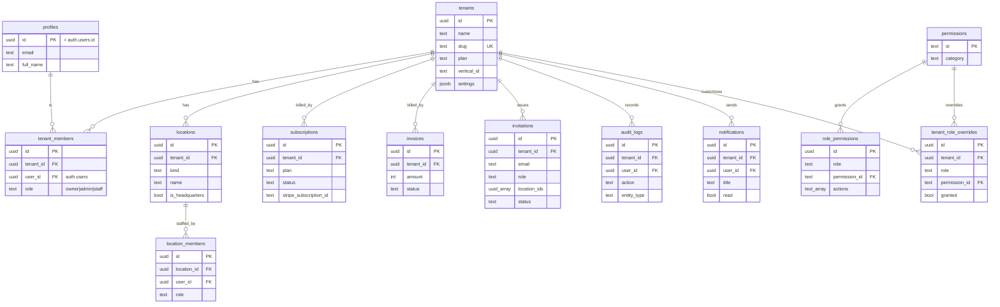
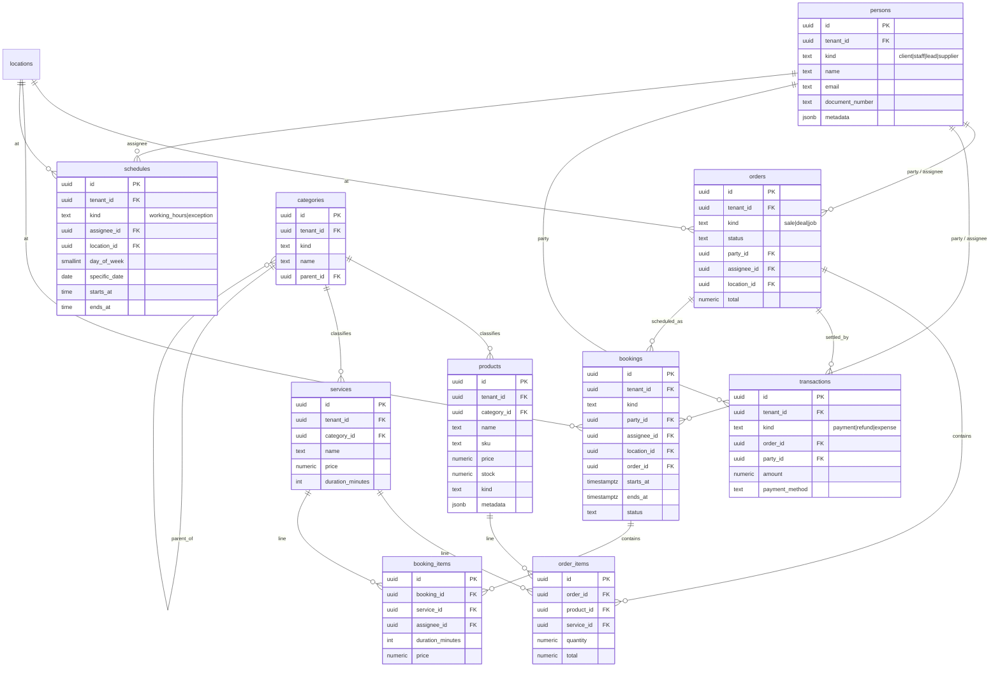
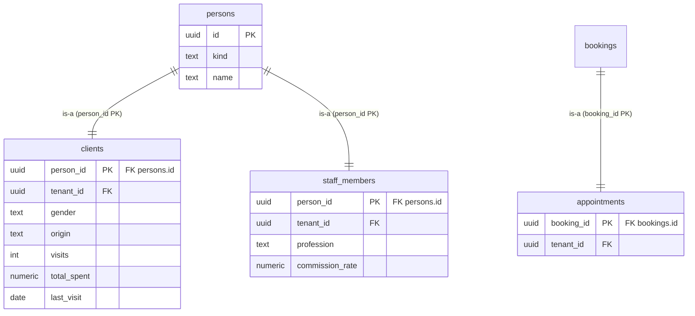
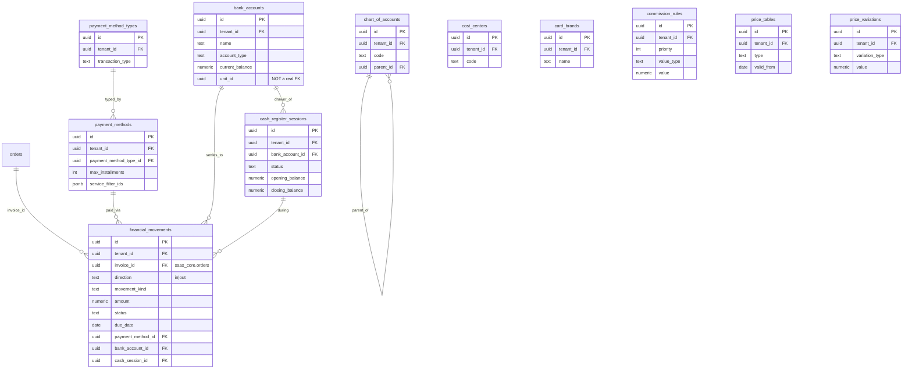
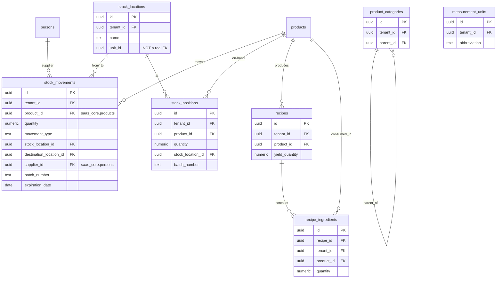
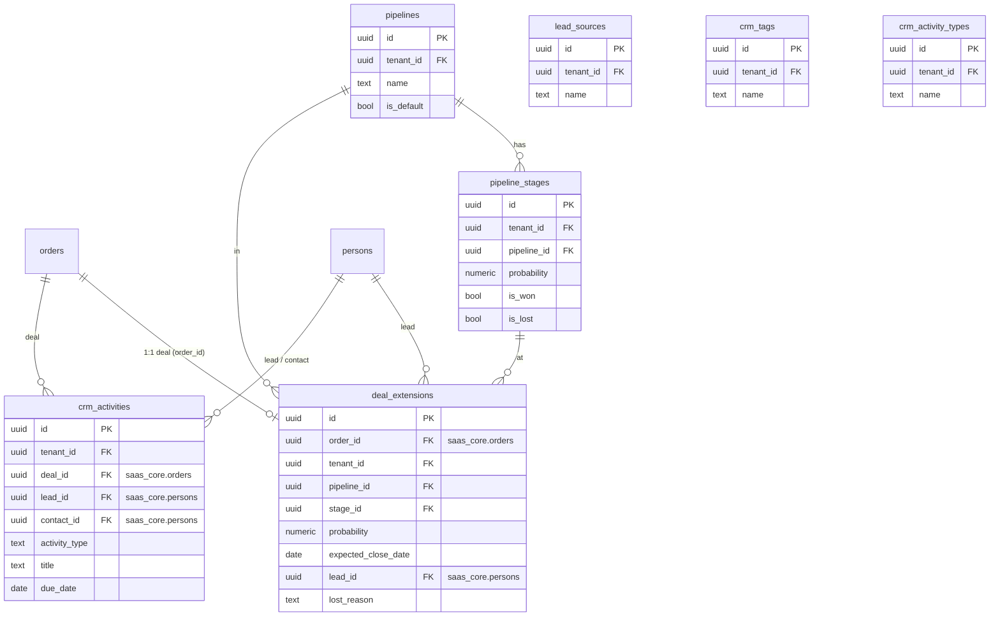
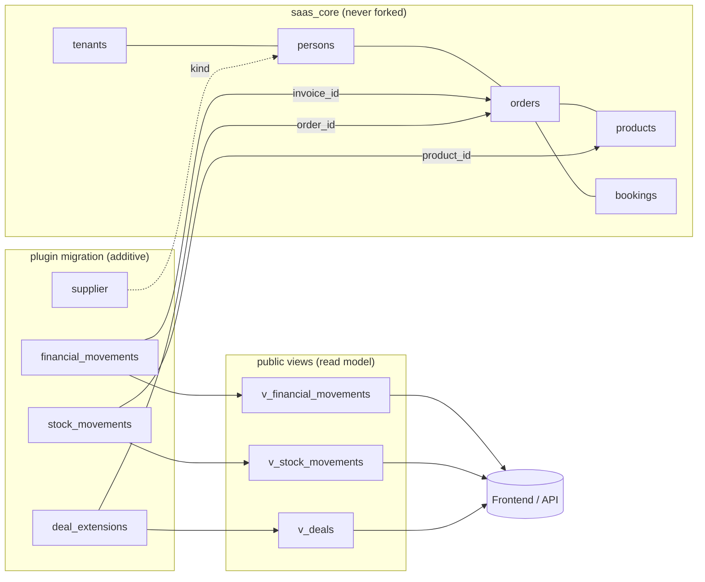

# Beauty-SaaS — Data Model & ERP Architecture Analysis

> Generated 2026-06-17. Source of truth: `supabase/migrations/*.sql`.
> This documents the **archetype + plugin** data model and assesses its fitness as the
> foundation for a modular ERP (the long-term "compete with Salesforce" ambition).

---

## 1. The big idea: two layers + plugins

The schema is deliberately split so that one generic core can serve *any* vertical, while
vertical- and feature-specific tables bolt on without forking the core.

| Layer | Schema | Purpose | Examples |
|-------|--------|---------|----------|
| **Platform** | `saas_core` | Tenancy, identity, RBAC, billing | `tenants`, `tenant_members`, `profiles`, `permissions`, `subscriptions` |
| **Archetypes** | `saas_core` | Universal business entities every vertical reuses | `persons`, `products`, `services`, `orders`, `bookings`, `transactions`, `schedules`, `categories`, `locations` |
| **Project (vertical)** | `public` | Beauty-specific *thin extensions* of archetypes | `clients`, `staff_members`, `appointments` |
| **Plugins** | `public` | Optional feature modules, each adds its own tables that FK back to archetypes | financial, inventory, crm, agenda |
| **Views** | `public` | Denormalized read models that join archetype + extension for the API | `v_clients`, `v_staff`, `v_bookings`, `v_deals`, `v_leads`, `v_financial_movements`, `v_stock_movements` |

Two extension mechanisms coexist:

1. **Shared-primary-key extension (1:1)** — `public.clients.person_id` *is* the PK and also
   a FK to `saas_core.persons.id`. The beauty row "is-a" person. Used for `clients`,
   `staff_members`, `appointments`.
2. **FK reference (N:1)** — a plugin table carries its own surrogate PK and points at an
   archetype, e.g. `stock_movements.product_id → saas_core.products`,
   `deal_extensions.order_id → saas_core.orders`.

The cleverness: **`kind` discriminator columns**. `orders.kind` can be `'sale'`, `'deal'`,
etc.; `persons.kind` can be `'client'`, `'staff'`, `'lead'`, `'supplier'`; `bookings.kind`,
`schedules.kind` likewise. One physical table, many logical entities — distinguished by
`kind` and surfaced through views.

---

## 2. Platform & tenancy core



**Tenancy is the spine.** Almost every table carries `tenant_id` and is protected by an
RLS policy of the form `tenant_id IN (SELECT tenant_id FROM tenant_members WHERE user_id = auth.uid())`.
Identity is delegated to Supabase `auth.users`; `profiles` mirrors it 1:1.

---

## 3. Archetype core (the universal ERP object model)



This is essentially a **Party + Product + Document** model — the same pattern behind
classic ERPs (and behind Salesforce's `Account`/`Contact`/`Opportunity`/`Order`). `orders`
is a *universal document*: a retail sale, a CRM deal, and a service job are all `orders`
distinguished by `kind`.

---

## 4. Beauty vertical — thin extensions of archetypes



Note how *little* the vertical adds: a client is a person plus a handful of CRM-ish stats;
a staff member is a person plus profession + commission rate; an appointment is literally
just a marker table over a booking. **The vertical is thin by design** — most behavior
lives in the archetypes and the plugins. `appointments` is currently an empty extension
(only the PK + tenant), which is a smell — see §9.

---

## 5. Plugin overlays

Each plugin is a self-contained set of `public` tables that reference `saas_core`
archetypes. They are additive: installing a plugin = applying its migration; the core
never needs to know they exist.

### 5.1 Financial plugin



> ⚠️ `financial_movements.invoice_id` references `saas_core.orders` — i.e. an order *is*
> the invoice. The column name (`invoice_id`) and target (`orders`) disagree, which will
> confuse anyone reading it cold. `chart_of_accounts`, `cost_centers`, and `commission_rules`
> exist as tables but are **not yet wired** to movements/line-items (no FK from a movement
> to an account or cost center) — the accounting model is scaffolded but not connected.

### 5.2 Inventory plugin



> ⚠️ `product_categories` (plugin) duplicates `saas_core.categories` (archetype). Two
> taxonomies for products now exist. `measurement_units` exists but `unit_id` columns
> across the schema (`bank_accounts.unit_id`, `stock_locations.unit_id`, `recipes.yield_unit_id`,
> `recipe_ingredients.unit_id`) are bare `uuid` with **no FK constraint** — referential
> integrity is not enforced for units or for "unit"(=location) references.

### 5.3 CRM plugin



> This is the most "Salesforce-shaped" plugin. A **deal is an order** (`order_id`) with a
> `deal_extension` carrying pipeline/stage/probability — exactly the Opportunity pattern.
> A **lead is a person** (`kind='lead'`). ⚠️ But several CRM links are *soft*:
> `crm_activities.activity_type` is free text instead of a FK to `crm_activity_types`;
> `crm_tags` has no junction table to attach tags to anything; `assigned_to_id` /
> `assigned_to_name` are denormalized loose pointers (no FK).

### 5.4 Agenda plugin

The agenda plugin adds **no tables**. It is pure logic over the `schedules` and `bookings`
archetypes — PL/pgSQL functions for availability and slot generation:

- `check_booking_overlap(tenant, assignee, starts_at, ends_at, exclude_booking)`
- `get_available_slots(tenant, assignee, date, duration, interval, schedule_kind)`
- schedule **exceptions** are stored as `schedules` rows with `kind='exception'` +
  `specific_date`, taking priority over recurring `working_hours` rows.

This is the cleanest demonstration of the model's intent: **a feature delivered entirely
through archetype data + functions, no new schema.**

---

## 6. How a plugin "comes in" — the install contract



The contract is consistent and worth stating explicitly because it is the product's
core IP:

1. **Reference, don't fork.** Plugin tables FK *into* `saas_core`; the core has zero
   knowledge of plugins.
2. **Carry `tenant_id` + RLS.** Every plugin table repeats the tenancy pattern so isolation
   is uniform.
3. **Discriminate with `kind`.** New entity types are new `kind` values, not new tables.
4. **Expose through a `v_`/`_view`.** The frontend reads denormalized views, never raw
   archetype joins — so the physical model can change under a stable read contract.

---

## 7. Strengths (what's genuinely good)

- **A real universal object model.** `persons / products / services / orders / transactions /
  bookings / schedules` is the correct ERP backbone. It generalizes cleanly — the same core
  already expresses retail (sale order), CRM (deal order), and services (booking) without
  bespoke tables. This is the single most important thing to get right, and it's right.
- **Plugins are truly additive & decoupled.** Reference-into-core (never fork) means you can
  ship a vertical by composing plugins. This is the modular-ERP thesis, and the schema
  honors it.
- **Multitenancy is uniform and enforced at the DB.** `tenant_id` + RLS via
  `tenant_members` on every table, `security_invoker` views, SECURITY DEFINER helpers to
  dodge RLS recursion. Tenant isolation doesn't depend on app code remembering to filter —
  that's the Salesforce-grade default.
- **RBAC is data-driven and tenant-overridable.** `permissions` → `role_permissions` →
  `tenant_role_overrides` lets each tenant customize a role's grants. That's a real
  permissions engine, not hardcoded roles.
- **Read/write separation via views.** The `v_*` layer decouples the API shape from physical
  storage — you can refactor archetypes without breaking clients.
- **Extensibility hatches everywhere.** Every archetype has `metadata jsonb` + `tags`, so
  tenants/verticals can stash custom fields without migrations.

---

## 8. Weaknesses & risks (what's bad or fragile)

- **Discriminator-by-`kind` has no guardrails.** `kind` is free text with no enum/check
  constraint and no per-kind schema. Nothing stops `orders.kind='deel'`. A real platform
  needs an entity-type registry (allowed kinds, their required fields) — otherwise data
  quality erodes and every consumer reinvents validation.
- **Soft foreign keys & denormalized pointers.** `unit_id`, `assigned_to_id`,
  `crm_activities.activity_type`, `clients.origin` are loose `uuid`/`text` with no FK.
  These will silently rot. ERP credibility is referential integrity; this is the biggest
  gap relative to "compete with Salesforce."
- **Duplicate concepts across layers.** `product_categories` (plugin) vs
  `saas_core.categories`; `public.bank_accounts` defined in *both* the project-tables
  migration and the financial plugin. Two sources of truth for the same idea is exactly
  the entropy a modular system is supposed to prevent.
- **Naming/semantics mismatches.** `financial_movements.invoice_id → orders`,
  `appointments` as an empty marker table, `unit_id` meaning "branch/location" in some
  places and "measurement unit" in others. Cognitive landmines for plugin authors.
- **Accounting is scaffolded, not wired.** `chart_of_accounts`, `cost_centers`,
  `commission_rules` exist but nothing posts to them. A movement can't yet be classified to
  an account or cost center — so there is no GL, no trial balance, no real double-entry.
- **No cross-cutting platform primitives.** For a Salesforce-class ERP the following are
  *table-stakes* and currently absent: custom-field/metadata registry, polymorphic
  attachments/notes/comments, an activity/timeline feed (CRM has a private one — it should
  be a core primitive), workflow/automation rules, a generic tagging junction,
  outbound webhooks/integration events, and a full append-only audit/event log
  (`audit_logs` exists but isn't comprehensive).
- **Plugin lifecycle is "apply a migration," not managed.** There's no plugin registry,
  version, dependency, or enable/disable per tenant *in this DB* (the migration comment says
  that lives in the Fayz platform DB). Without it, "modular" is a convention, not an
  enforced capability — you can't safely uninstall, and tenants can't subscribe to a subset.

---

## 9. Gaps to close to be a credible modular ERP vs. Salesforce

Priority order, highest leverage first:

1. **Entity-type / `kind` registry** — make `kind` a managed dimension (allowed values,
   per-kind required fields & validation). Turns the clever discriminator into a governed one.
2. **Custom fields as a first-class system** — a metadata catalog over the `jsonb` columns
   (field defs, types, per-tenant). This is *the* Salesforce superpower; you already have the
   storage (`metadata`), you lack the catalog + UI contract.
3. **Enforce referential integrity** — convert every soft pointer (`unit_id`, `*_to_id`,
   activity/category text keys) into real FKs. Cheap, high trust payoff.
4. **Unify duplicated concepts** — one categories model, one `bank_accounts`, one tagging
   mechanism (a polymorphic `entity_tags` junction).
5. **Core cross-cutting primitives** — promote to `saas_core`: polymorphic
   `activities/timeline`, `attachments`, `comments`, `tags`, `webhooks/events`. Plugins and
   verticals then inherit them for free.
6. **Real accounting wiring** — post `financial_movements` to `chart_of_accounts` +
   `cost_centers`; double-entry; reconciliation against `cash_register_sessions`.
7. **Plugin manifest & per-tenant enablement in-DB** — registry with version + dependencies
   + install/uninstall hooks, and a tenant↔plugin grant table. Without this the platform
   can't sell modules à la carte safely.
8. **Workflow/automation layer** — declarative rules ("when order.kind=deal moves to stage
   won → create transaction"). Salesforce is as much a workflow engine as a database.

---

## 10. Verdict

The **foundation is genuinely strong**: a correct universal object model, true plugin
decoupling, DB-enforced multitenancy, and a data-driven permission system. That's ~70% of
the hard architectural bet, and it's the right bet.

The **gap is "platform-ization"**: the model is a well-designed *application schema*, not yet
a *platform*. Salesforce's moat isn't its object model — it's the metadata layer (custom
objects/fields), the automation engine, and the integrity/governance around extensibility.
Here, `kind` and `metadata jsonb` are the seeds of that metadata layer but are currently
ungoverned, soft FKs undercut trust, and several primitives a platform must own (custom-field
registry, polymorphic activity/attachments, workflow, in-DB plugin lifecycle) are missing.

Close §9 items 1–5 and this stops being "a beauty SaaS with good bones" and becomes "a
modular ERP core that happens to ship a beauty vertical first."
```
